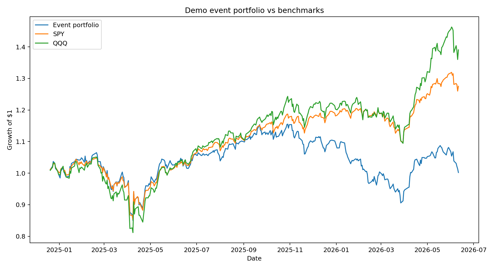
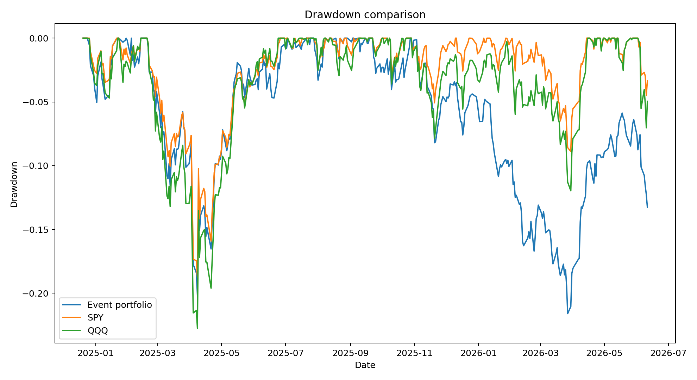
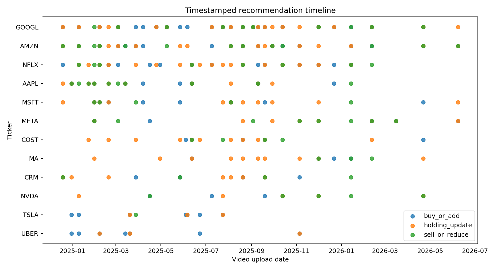
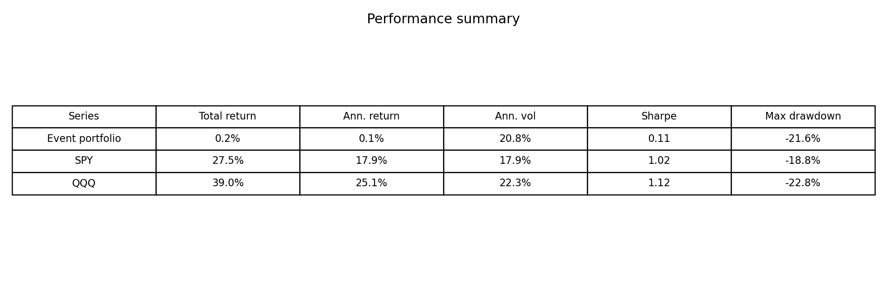

# Finfluencer Portfolio Analysis

This is a small finance/data-science project for analysing stock recommendations from finance YouTube content.

The idea is simple: take timestamped video transcripts, extract stock-pick and portfolio-update candidates, turn them into a structured dataset, and compare the subsequent performance with broad market benchmarks.

The current version is a proof of concept. It is not meant to be a finished investment model. The extracted recommendations still need manual verification through the timestamp links before they can be used in the final academic analysis.

## What the pipeline does

- collects YouTube video metadata and transcripts
- extracts stock-pick / portfolio-update candidates from transcript text
- keeps source links, timestamps and context for manual checking
- cleans the extracted events into a usable CSV
- downloads adjusted price data
- computes first forward-return and event-portfolio results
- compares the demo portfolio with SPY and QQQ
- creates figures for the report/presentation

## Example outputs

### Event portfolio vs benchmarks

### Drawdown comparison

### Recommendation timeline

### Performance summary

## Current workflow

1. Download/collect transcript and video metadata.
2. Extract candidate stock recommendations with timestamps.
3. Manually verify the important Buy/Sell/Hold rows.
4. Build the final portfolio timeline.
5. Compare performance against benchmarks.
6. Use the verified dataset for regressions, event study and the final report.

## Important limitations

The current event portfolio is only a first demo. It uses a simple rule: enter after detected buy/add events, hold for a fixed period, and equal-weight active positions.

For the final project, the recommendation rows should be manually verified, and the portfolio construction rules should be documented clearly.

Raw full transcripts are intentionally not included in the repository.
